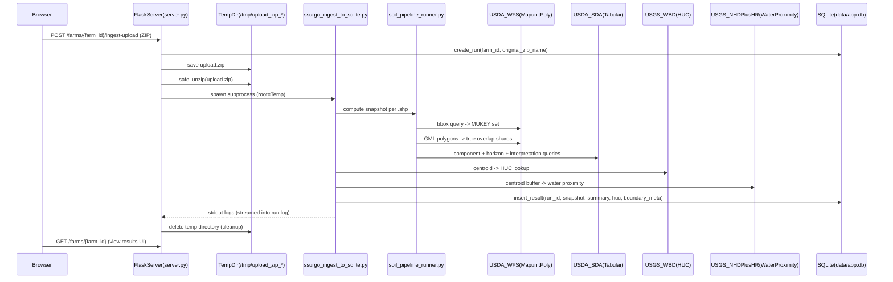

# SSURGO ZIP Ingest — Pipeline Walkthrough (for Purdue students)

This doc explains what happens when you upload a ZIP, how we query SSURGO, and what “results” mean. It’s meant to be presentation-friendly and a good starting point for adding diagrams.

---

## Big picture

You upload a ZIP of field boundary shapefiles. The service:

1. extracts the ZIP into a temp directory
2. finds `.shp` files
3. for each field polygon:
   - finds which SSURGO **map units** overlap the field
   - downloads SSURGO component/horizon data from USDA **Soil Data Access (SDA)**
   - computes engineered features (K factor, OM, texture, etc.)
   - computes an **area-weighted summary**
   - enriches with **HUC** and **surface water proximity**
   - optionally adds **R-factor** from a GeoTIFF
4. stores results in **SQLite** (farms → runs → results)
5. deletes the uploaded ZIP + extracted files when the job finishes

---

## Runtime architecture (ZIP upload → results)

Code pointers:
- ZIP upload endpoint: `server.py`
- safe extraction: `fetch_zip_and_ingest.py` (`safe_unzip`)
- ingest loop + SQLite writes: `ssurgo_ingest_to_sqlite.py`
- SSURGO compute pipeline: `soil_pipeline_runner.py` + `ssurgo/*`

---

## Step-by-step: what happens for *one* shapefile

### 1) Read boundary geometry + attributes

From the shapefile we read:
- the **polygon geometry** (union of all polygon features)
- the DBF **attributes** (things like FIELD name, grower, etc.)

Code: `ssurgo/field_io.py`
- `read_field_union(shp_path)` → `(geom, id_fields)`
- `read_field_metadata(shp_path, geom, id_fields)` → `boundary_meta` (centroid, bbox, area, etc.)

Important assumption:
- The pipeline treats shapefile coordinates as **lon/lat (EPSG:4326)**. We *record* `.prj` WKT, but we do not reproject the geometry based on it. If students upload a shapefile in a different CRS, results will be wrong.

### 2) Find candidate SSURGO map units (MUKEYs) for the field bbox

We ask USDA’s WFS service for map units intersecting the **bounding box** of the field:

- Endpoint: WFS `MapunitPoly`
- Output: a set of **MUKEY** values

Code: `ssurgo/mukey_lookup.py` → `mukeys_for_bbox(geom.bounds)`

### 3) Compute “true overlap” area shares by MUKEY (not sampling)

This is the step you called “generate samples”.

What actually happens:
- We download WFS polygons for map units in the same bbox.
- We intersect each map unit polygon with the *field polygon*.
- We compute overlap area in an equal-area projection (EPSG:5070).
- We normalize overlap areas so shares sum to ~1.

Result:
- `mukey_shares = { MUKEY: fraction_of_field_area }`

Code: `ssurgo/mukey_weights.py` → `area_shares_wfs_gml(field_geom)`

So it’s **not random sampling**. It’s deterministic geometry intersection and weighting.

### 4) Query USDA Soil Data Access (SDA) tabular service

We use the MUKEY set to pull tabular soil data from SDA:
- components (`component`) joined with map-unit aggregates (`muaggatt`)
- horizons (`chorizon`)
- fragments (`chfrags`)
- textures (`chtexture*`)
- restrictions (`corestrictions`)
- interpretations (compaction + several “CART” style ratings)

Code: `ssurgo/sda_client.py`

### 5) Engineer features from horizons (e.g., 0–20cm and 0–100cm aggregates)

From the horizon rows we compute:
- `K_surface` (0–20cm)
- `om_0_20`
- `bd_0_20`
- `ksat_0_100`
- `coarse_frag_pct` (0–100cm)
- plus clay/sand/silt fractions and a surface texture class

Code: `ssurgo/featurize.py` → `horizon_aggregates(...)`

### 6) Aggregate into a field-level summary

We compute a field-level summary using nested weighting:

1) **Within each MUKEY**: weight components by `comppct_r` (component percent)
2) **Across MUKEYs**: weight by `mukey_shares` (true overlap shares)

If overlap shares can’t be computed, we fall back to equal MUKEY shares.

Code: `ssurgo/aggregate.py` → `compute_summary(rows, mukey_shares)`

### 7) Add hydrology + context enrichments

Using the field centroid:
- HUC hierarchy: `enrich_huc.py` → `query_wbd_point(lon, lat)`
- Surface water proximity: `enrich_huc.py` → `check_surface_water_proximity(lon, lat)`
- Optional R-factor: `ssurgo/r_factor.py` samples a GeoTIFF at the centroid (requires Rasterio)

### 8) Store results in SQLite

Each uploaded ZIP becomes a **run**; each shapefile becomes a **result row**:
- `farms`: farm records
- `runs`: run metadata + a capped log
- `results`: one row per shapefile (summary + snapshot + huc + boundary_meta)

Code: `db/sqlite_store.py`

---

## What “results” mean (what students should interpret)

For each field/shapefile, the key output is `summary_json`, which includes:
- `area_weighted` metrics: slope, K_surface, T, ksat, OM, etc.
- `weighted_wt_*` water-table depth proxies from `muaggatt`
- texture-family mode + a “fine_or_loam_taxonomy_pct” heuristic
- a small `qa` block (weights sum, units, etc.)

The output is designed to support:
- “What soil types dominate this field?”
- “What’s the weighted K factor / OM / slope?”
- “Is the centroid near surface water?”
- “What HUC watershed is this in?”

---

## Where to look in code (recommended reading order)

1. `server.py` (upload endpoint and job runner)
2. `fetch_zip_and_ingest.py` (`safe_unzip` filtering and extraction)
3. `ssurgo_ingest_to_sqlite.py` (loop, enrichments, SQLite write)
4. `soil_pipeline_runner.py` (the orchestration of the SSURGO compute)
5. `ssurgo/mukey_lookup.py` + `ssurgo/mukey_weights.py` (MUKEY set + overlap weights)
6. `ssurgo/sda_client.py` (all SDA queries)
7. `ssurgo/featurize.py` + `ssurgo/aggregate.py` (feature engineering + aggregation)

